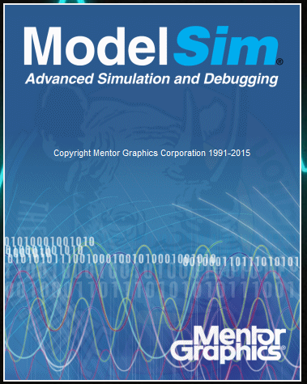
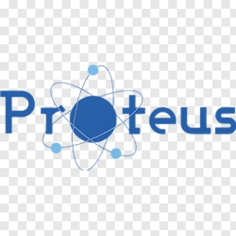

<h1 align="center">Hi 👋, I'm Maaz Adil</h1>
<h3 align="center">Electrical Engineering Student | Creative Technologist | Tech Explorer</h3>

  

---

### 👨‍💻 About Me

- 🎓 I'm a student of **Electrical Engineering** from **Hyderabad, Pakistan**  
- 🤖 Passionate about **Robotics**, **Embedded Systems**, **Game Development**, and **Coding**
- 🎬 Love **filmmaking** – from **2D/3D animation**, **realistic VFX**, **CGI**, to **3D modeling**
- 💬 I speak **Urdu** and **English**
- 🚀 Currently building personal projects (will be published soon!)
- 🌑 I enjoy working in **dark theme**, mixing fun with professionalism

---

### 🛠️ Languages & Tools

#### 👨‍💻 Programming & Hardware:

  
  
  
  
  

#### 🎥 Creative Tools:

  
  
  
  
  

#### ⚙️ Engineering & Simulation:

  
  
  
  
  
  

---

### 📈 GitHub Stats

  

  

  

---

### 🌐 Connect With Me

  
  
  
  

---

### ⚡ Fun Fact:
> "Creativity is just intelligence having fun!" – And I love mixing circuits with cinema!

---

### 👣 Visitors

  

